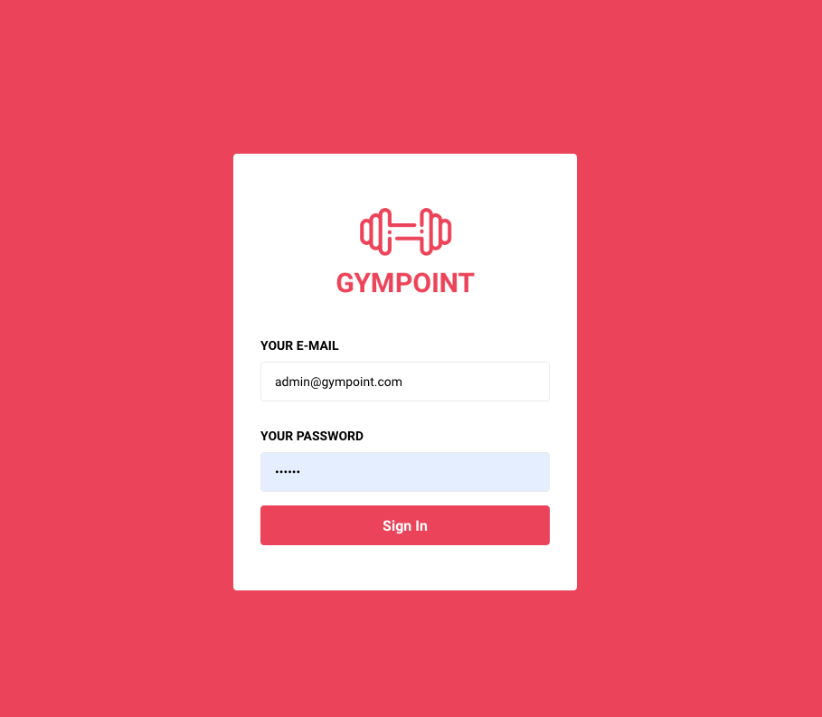
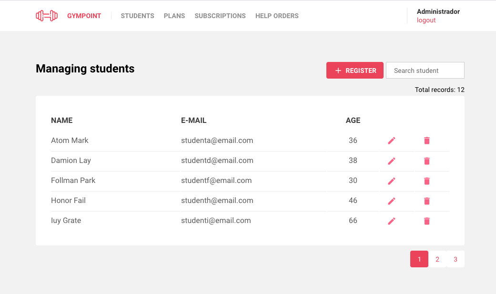
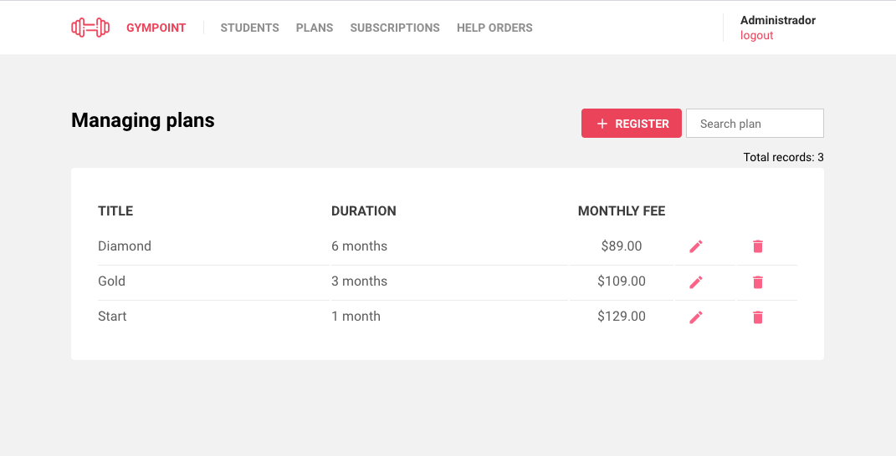
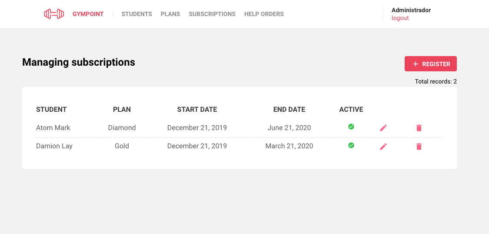
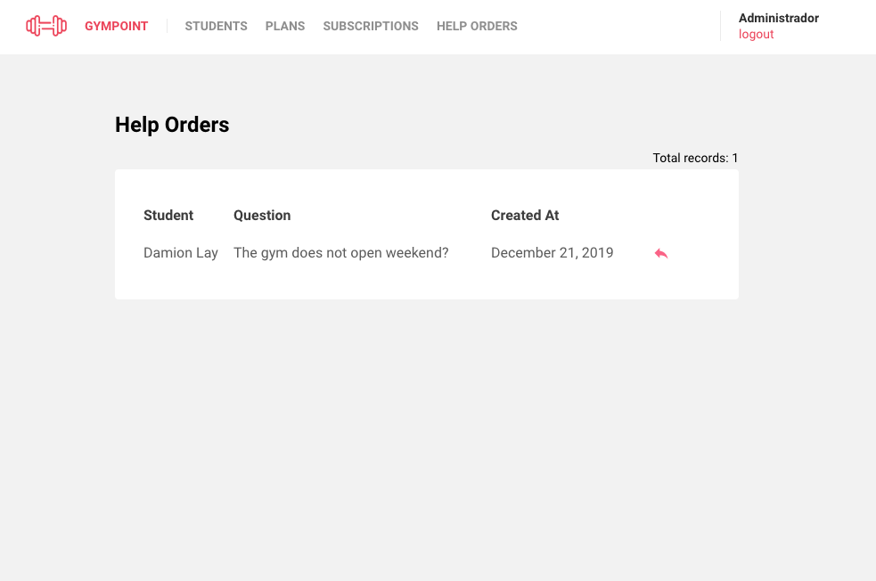
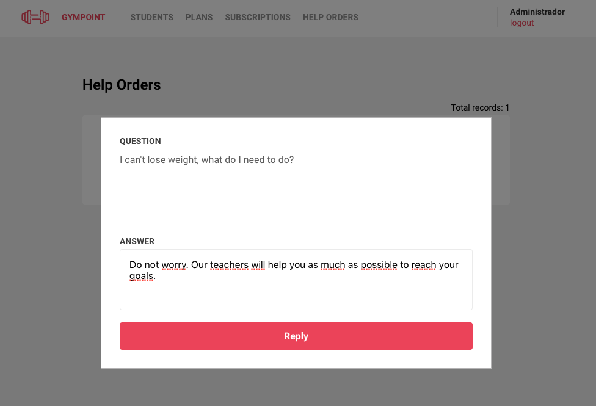
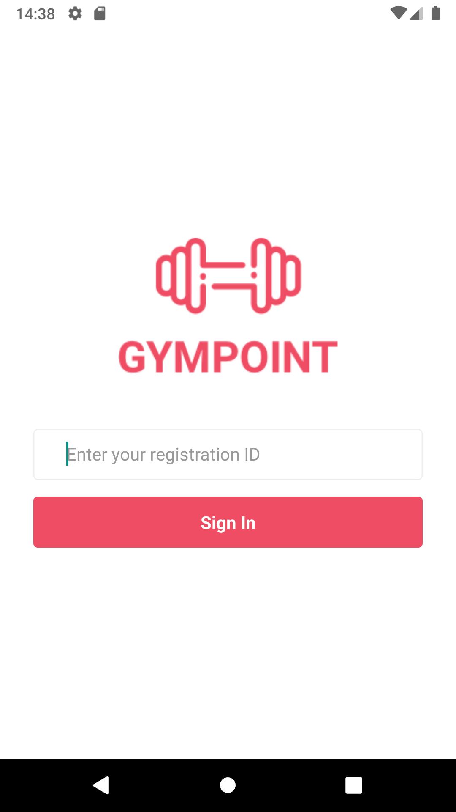
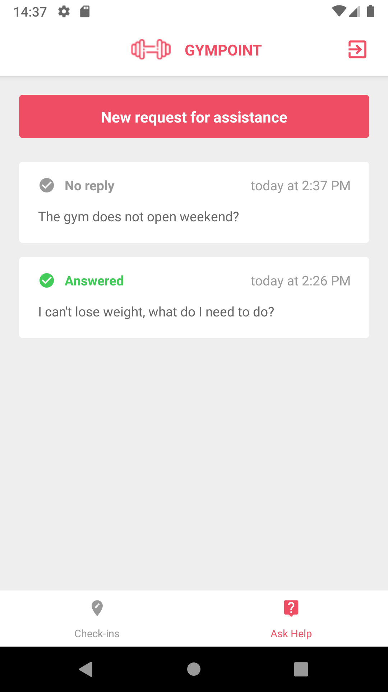
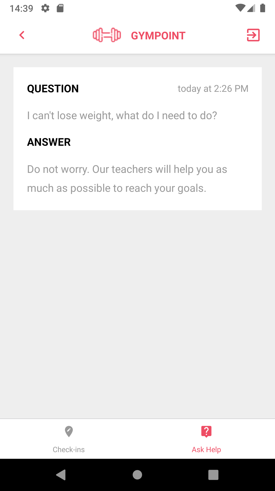
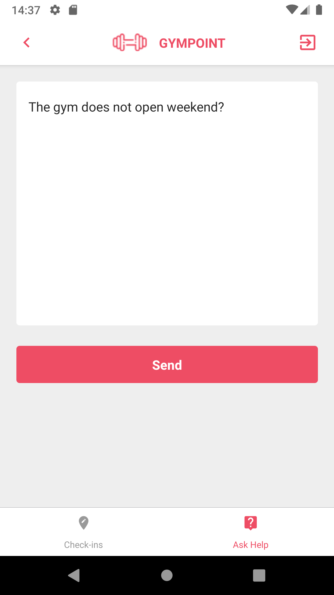

<h1 align="center">
  
</h1>

<h3 align="center">
  Final Challenge: Gympoint backend, frontend and mobile projects
</h3>

<p align="center">
  <a href="#about-challenge">About challenge</a>&nbsp;&nbsp;&nbsp;|&nbsp;&nbsp;&nbsp;
  <a href="#install-instructions">Install Instructions</a>&nbsp;&nbsp;&nbsp;|&nbsp;&nbsp;&nbsp;
  <a href="#screenshots">Screenshots</a>&nbsp;&nbsp;&nbsp;|&nbsp;&nbsp;&nbsp;
</p>

## **About Challenge**

During the GoStack 9 bootcamp we were challenged to build a gym application. This repository is divided into 3 parts: backend, frontend and mobile.

The web version of the Gympoint project represents the vision of the gym, ie all features present in the web version are for administrators. The features for the student will be arranged in the mobile app.

Technologies: Database: Postgres, Backend: Node.js, Frontend: ReactJS, Mobile: React Native

## **Install instructions**

To see the app working, follow the steps below:

## 1. Clone repository

**SSH**
```git
git@github.com:EDevLevy/bootcamp-gostack-9-final-challenge.git <projectname>
```
**HTTPS**
```git
https://github.com/EDevLevy/bootcamp-gostack-9-final-challenge.git <projectname>
```
## 2. Install dependencies and configure

1. From root project folder execute `yarn install:all`

### Backend

2. From **Backend** project folder create `.env` file and set these constants and execute the commands below

```js
APP_SECRET=

DB_HOST=
DB_USER=
DB_PASS=
DB_NAME=
DB_PORT=

REDIS_HOST=
REDIS_PORT=
//optional
MAIL_HOST=
MAIL_PORT=
MAIL_USER=
MAIL_PASS=
//optional
SENTRY_DSN=
```
4. `docker-compose -up -d` (if you use have docker installed)
5. `yarn sequelize db:migrate`
6. `yarn sequelize db:seed:all`
7. `yarn dev`
8. Open another terminal or prompt for this folder and execute `yarn queue`

### Frontend

Execute inside **frontend** folder:

1. execute `yarn start`
2. Open browser and go to `http://localhost:3000`
3. On `Sing In` Page, use admin@gypoint.com as **user** and `123456` as **password**

### Mobile

Requirements
 - Android Studio Installation and Android Emulator Executing

Execute inside **mobile** folder:

1. `yarn android`
2. To sign in to the student mobile application, create a student from the web application, do subscription, and use the student ID sent in the subscription email


Enjoy!

## Screenshots

### Frontend
<div align="center">
  
</div>
<div align="center">
  
</div>
<div align="center">
  
</div>
<div align="center">
  
</div>
<div align="center">
  
</div>
<div align="center">
  
</div>

### Mobile

<div align="center">
  
  
  
  
  
</div>
